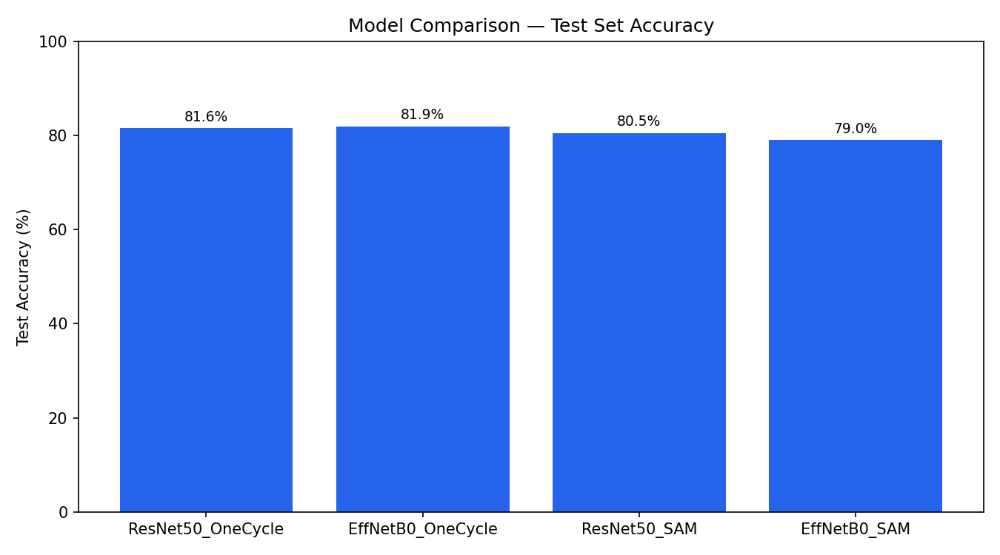
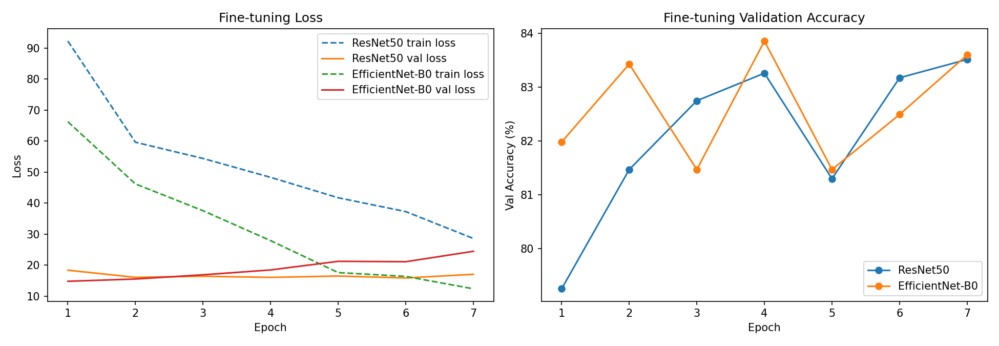
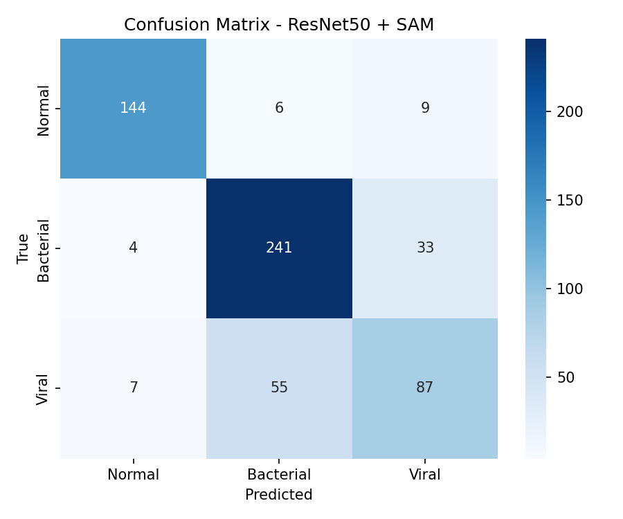
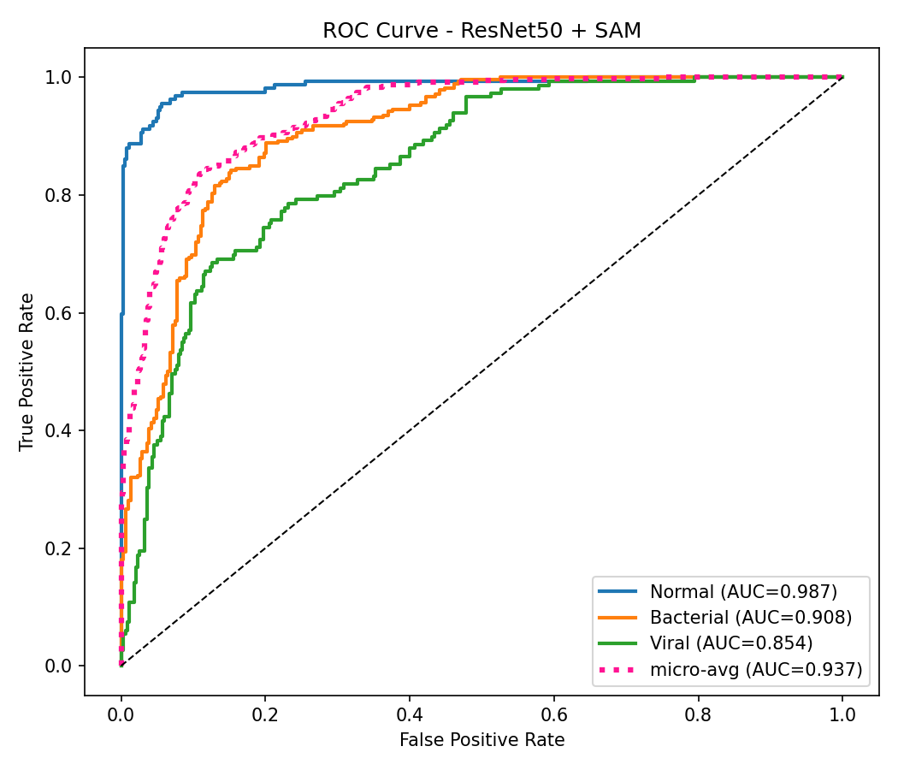
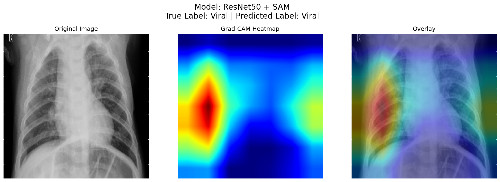

# 🫁 Pneumonia Detection using Transfer Learning

A deep learning project for **multi-class pneumonia classification** from chest X-ray images using **transfer learning**. This project investigates multiple transfer learning strategies with **ResNet50** and **EfficientNet-B0**, comparing **feature extraction** and **end-to-end fine-tuning** approaches for automated pneumonia detection.

To improve model transparency, **Grad-CAM** is used to visualize the image regions that influence model predictions, making the classification process more interpretable.

---

## 📖 Overview

Pneumonia is one of the leading causes of respiratory illness worldwide. Chest X-ray analysis is commonly used for diagnosis, but manual interpretation can be time-consuming and requires expert knowledge.

This project explores how transfer learning can improve pneumonia classification by leveraging pretrained convolutional neural networks and compares different transfer learning strategies on the same dataset.

The project performs **three-class classification**:

- 🟢 Normal
- 🟠 Bacterial Pneumonia
- 🔴 Viral Pneumonia

---

# ✨ Features

- Multi-class chest X-ray classification
- Transfer learning using pretrained CNN models
- Comparison of feature extraction and fine-tuning
- ResNet50 and EfficientNet-B0 backbones
- Hyperparameter optimization using:
  - SAM Optimizer
  - OneCycle Learning Rate Scheduler
- Explainable AI using Grad-CAM
- Comprehensive performance evaluation
- Visual comparison of multiple transfer learning approaches

---

# 📂 Repository Structure

```text
Pneumonia-Detection-using-Transfer-Learning/
│
├── assets/
│   ├── confusion_matrix.png
│   ├── gradcam_example.png
│   ├── metrics.csv
│   ├── model_comparison.png
│   ├── roc_curve.png
│   └── training_curves.png
│
├── .gitignore
├── LICENSE
├── README.md
├── requirements.txt
└── Pneumonia-Detection-using-Transfer-Learning.ipynb
```

---

# 📊 Dataset

This project uses the **Chest X-Ray Images (Pneumonia)** dataset available on Kaggle.

### Dataset Statistics

| Split | Images |
|-------|-------:|
| Training | 4099 |
| Validation | 1171 |
| Testing | 586 |

### Classes

- Normal
- Bacterial Pneumonia
- Viral Pneumonia

The images were resized, normalized, and augmented before training using Albumentations.

---

# 🏗️ Models Evaluated

Four transfer learning strategies were implemented and compared.

| Model | Strategy |
|--------|----------|
| ResNet50 + Logistic Regression | Feature Extraction |
| EfficientNet-B0 + Logistic Regression | Feature Extraction |
| ResNet50 | Fine-Tuning |
| EfficientNet-B0 | Fine-Tuning |

---

# 📈 Performance

| Model | Training Strategy | Test Accuracy |
|--------|-------------------|--------------:|
| ResNet50 + Logistic Regression | Feature Extraction | **75.1%** |
| EfficientNet-B0 + Logistic Regression | Feature Extraction | **75.4%** |
| EfficientNet-B0 | Fine-Tuning | **81.4%** |
| **ResNet50** | **Fine-Tuning** | **85.3%** |

Among all evaluated models, the **fine-tuned ResNet50** achieved the highest classification accuracy and demonstrated the best overall performance.

---

# 📷 Results

## Model Comparison



---

## Training Curves



---

## Confusion Matrix



---

## ROC Curve



---

## Grad-CAM Visualization

Grad-CAM highlights the regions of the chest X-ray that contribute most to the model's prediction, providing visual interpretability for the classification results.



---

# 🛠️ Technologies Used

### Programming Language
- Python

### Deep Learning Frameworks
- PyTorch
- TorchVision
- timm

### Data Processing & Augmentation
- NumPy
- Pandas
- Albumentations
- OpenCV (opencv-python)
- Pillow

### Machine Learning & Evaluation
- Scikit-learn
- TorchMetrics

### Visualization
- Matplotlib
- Seaborn

### Development Environment
- Google Colab
- Kaggle (Dataset)

### Utilities
- tqdm

---

# 📋 Evaluation Metrics

The models were evaluated using multiple performance metrics, including:

- Accuracy
- Precision
- Recall
- F1-Score
- Confusion Matrix
- ROC-AUC
- Cohen's Kappa

---

# 🚀 Getting Started

## Clone the Repository

```bash
git clone https://github.com/tharakvenkat/Pneumonia-Detection-using-Transfer-Learning.git
```

## Install Dependencies

```bash
pip install -r requirements.txt
```

## Run the Notebook

Open

```text
Pneumonia-Detection-using-Transfer-Learning.ipynb
```

using **Google Colab** or **Jupyter Notebook** and execute the notebook cells sequentially.

---

# 📌 Key Highlights

- Developed a deep learning pipeline for automated pneumonia detection.
- Compared four different transfer learning strategies.
- Achieved **85.3%** test accuracy using a fine-tuned ResNet50.
- Applied Grad-CAM to improve model interpretability.
- Performed comprehensive evaluation using multiple classification metrics.
- Demonstrated the effectiveness of transfer learning for medical image analysis.

---

# ⚠️ Medical Disclaimer

This project is intended solely for **educational and research purposes**. It is **not** a certified medical device and should **not** be used for clinical diagnosis, treatment planning, or medical decision-making.

---

# 👨‍💻 Author

**Tharak Venkat Imadabattuni**

Bachelor of Technology in Computer Science and Engineering

GitHub: https://github.com/tharakvenkat
